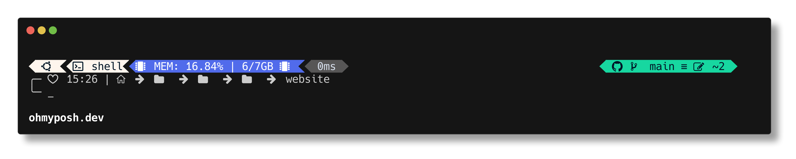
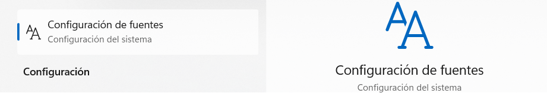
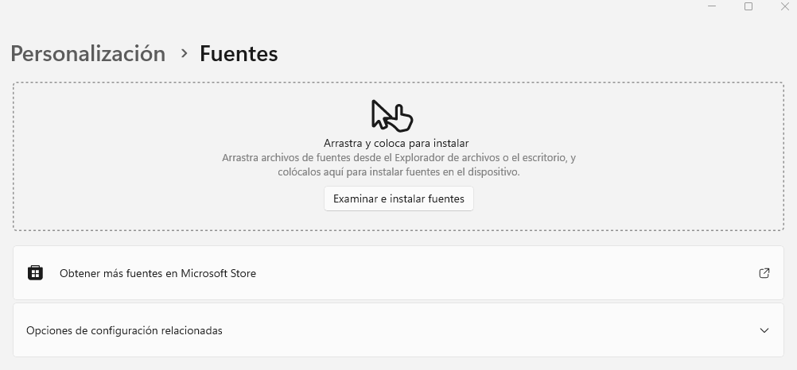
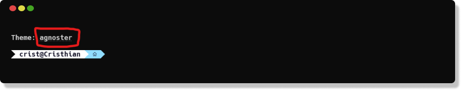

# Oh my posh
---


### 1) Instalacion para windows
```
winget install JanDeDobbeleer.OhMyPosh -s winget
```
### 2) Verficar instalacion
Una vez instalado reiniciar la terminal y ejecutar el siguiende comando para revisar.

```
oh-my-posh get shell
```
### 3) Archivo de configuración
Para crear el archivo de configuración de la terminal escribir el siguiente comando.

```
New-Item -Path $PROFILE -Type File -Force
```

### 4) Instalar fuente

Una vez creado el archivo, se debe instalar la fuente para reconocer los iconos, enlace para descargar la fuente <a href="https://github.com/ryanoasis/nerd-fonts/releases/download/v3.0.1/Hack.zip">Hack Nerd Font</a>

El siguiente paso es agregar las fuentes al sistema, escribir la palabra ```font``` en el buscador y seleccione:
<br>



y arrastra todo las fuentes descomprimidas al recuadro, no arrastrar la carpeta, unicamente los archivos ```.ttf```

<br>



### 4) Configurar terminal
Abrir una carpeta y pegar la siguiente ruta:
```
%LOCALAPPDATA%\Packages\Microsoft.WindowsTerminal_8wekyb3d8bbwe\LocalState\settings.json
```

una vez abierto el archivo, escribir la siguiente configuracion en ```profiles > defaults```

```
"profiles": 
{
    "defaults": 
    {
        "font": 
        {
            "face": "Hack Nerd Font Mono",
            "size": 11.0
        },
        "opacity": 85
    }
    ...
}
```

ahora en visual studio code para instalar el tema, damos ```ctrl + shit + p``` y escribimos ```settings json``` abrimos el archivo json y pegamos:
```
"terminal.integrated.fontFamily": "Hack Nerd Font Mono"
```

### 5) Instalar temas
Una vez realizado todo, ya solo queda instalar los temas para la terminal
```
Get-PoshThemes
```

### 6) Agregar tema
Debemos agregar el tema a la configuracion creada de la terminal, abrimos el archivo con el siguiente comando:
```
notepad $PROFILE
```

Se abrira un block de notas vacio y agregamos la siguiente linea y guardamos:

```
oh-my-posh init pwsh --config "$env:POSH_THEMES_PATH\nombredeltema.omp.json" | Invoke-Expression

```
donde dice ```nombredeltema``` reemplazarlo por el nombre elegido que quieras al instalar los temas
<br>

