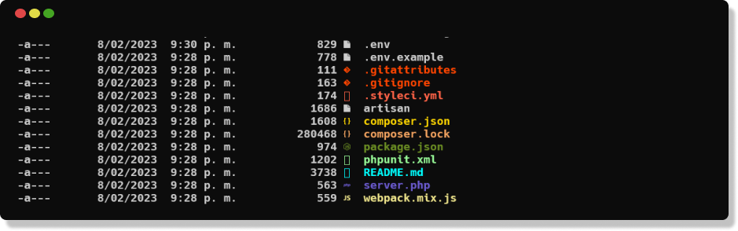

# terminal icons
---



Instalación
```
Install-Module -Name Terminal-Icons -Repository PSGallery
```

> Si ya tienes el archivo de configuracion de la terminal omitir el paso de instalación y abrir directamente

Crear el archivo de configuración de la terminal, escribir el siguiente comando.

```
New-Item -Path $PROFILE -Type File -Force
```

Abrir el archivo de configuracion
```
notepad $PROFILE
```
y pegamos la siguiente linea en block de notas y guardamos:

```
Import-Module -Name Terminal-Icons
```