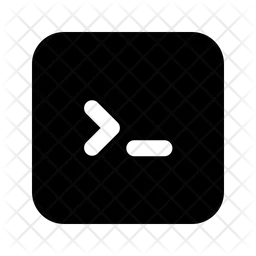

### Herramientas frontend

Lista de guias y herramientas de programación para desarrollo y agilizar   los proyectos, se encontrara todo lo necesario para desarrollo web

    
    
    
    
    
    
    
    
    

<footer>
    Creado por - Cristhian mahecha ❤️
</footer>

